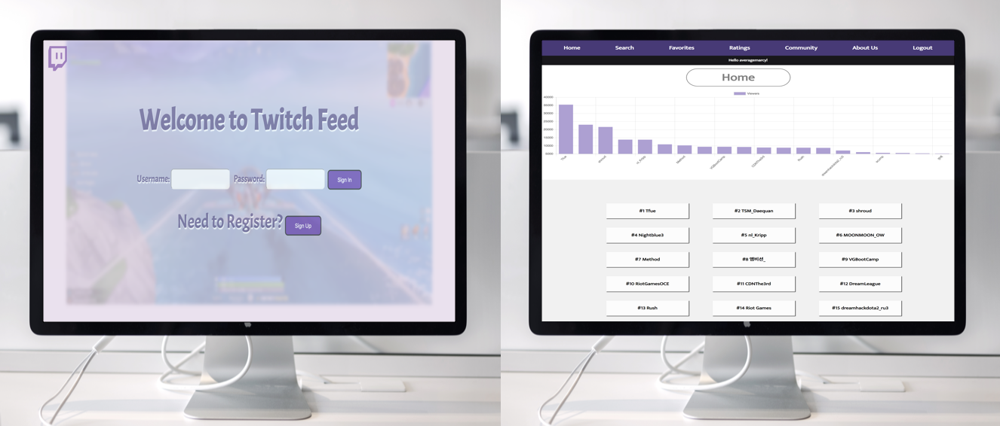

## Full Stack Project Week

This week marked our second final project week of this program. Much like the first group project, we were split into groups of three and four to create a full stack app that used CRUD, user authentication, and third-party API. Our group decided to do a Twitch themed app that allowed users to comb through the Twitch API to see the top 20 streamers at anytime, then add a streamer to their favorites, search for a streamer, as well as rate streamers and see how they stack up to other streamers in the community. This project was tricky. 

Luckily, I adored my group, we got along great and we communicated well with one another which made the project much easier to deal when we ran into issues. First off, the TWITCH IS A NIGHTMARE! Its is robust, but it is hard to prop drill what you need. Objects are named inconsistently, so grabbing something simple like a streamer name, you have to query for the top 25, then query for their ID, and then query for their profile. As you can imagine it was challenging. But we pulled through and our app turned out amazing. The home page has a really cool chart that displayed the top 20 streamers and every time you refresh the page, it will automatically hit the API to render the latest stats. 

The favorites page came along great, it shows the streamers profile picture, if they are online or not, their number of followers, total views, and the current name of the category they are streaming. We really wanted to create an app that Twitch users would use. At the moment, the Twitch site doesn't really have the features that we have and it's amazing to think that we created an app that is a compliment to a site that is crazy popular. 

## Twitch App
https://twitch-feed-2.herokuapp.com
