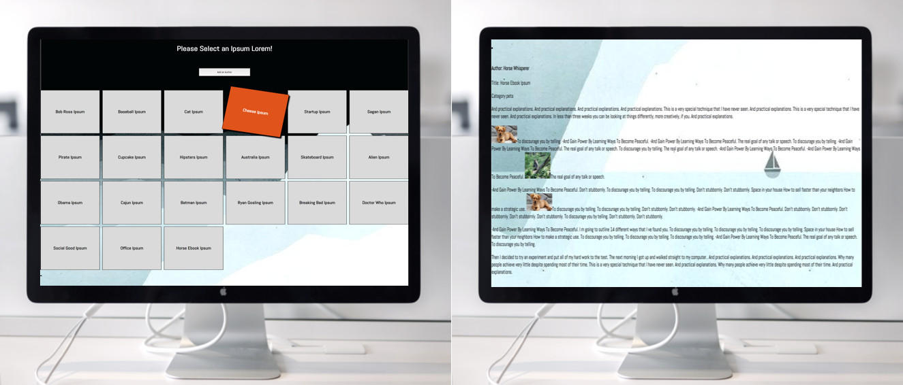

## Introduction to a Front-End Framework - Vue.js

This week was amazing! Probably one of my favorites so far. We learned how to use Vue.js, which, oh my goodness, where was this from the beginning. I didn't understand why people raved about front-end frameworks like Angular, React, and Vue until now. Vanilla JS is cool and all, and its incredibly important to learn the fundamentals, but I can't help it, seeing an @click event listener for a button was sorcery! However, understanding component architecture and the way that props/functions were passed from parent to child is still a little shakey. From what I can understand with Vue its is really fast when it comes to compiling data, the docs are fantastic, and it allows you to write HTML and CSS within the same component. It feels really natural to see the HTML, JS, and CSS within the same file, but I do wonder if I will change my mind when I start working with much larger and complex apps. 

### Lorem Ipsum App
User is able to click on an ipsum and see the ipsum displayed at the bottom. The user is also able to add their own ipsum by filling out a form with the author's name, title, date, the ipsum itself. 
