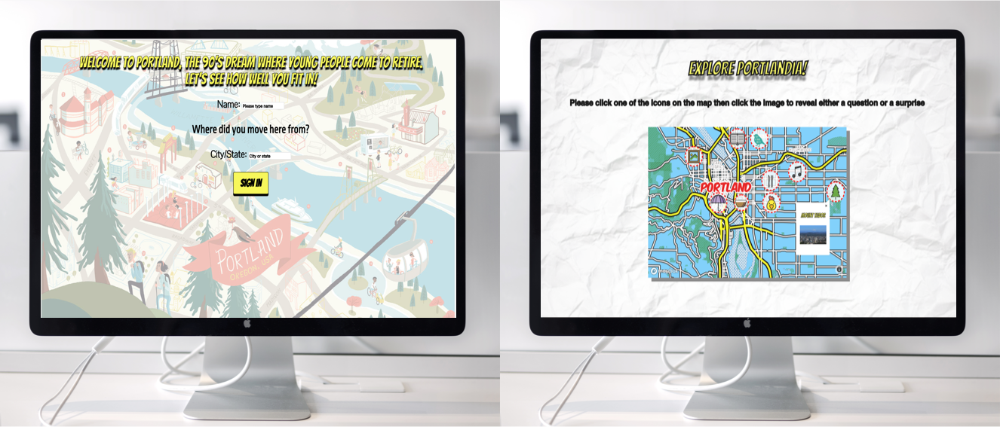

## First Group Project!

So this week we were split up into groups and were tasked with coming up with our own projects that displayed our knowledge of CSS, HTML, and Vanilla Javascript. Our group decided to do a Portlandia game that was a parody of Portland and the culture behind, specifically what it means to be a Portlander. The user will take a tour of Portland and click on locations around the city, depending on the answers given at each location decided whether or not they were true Portlanders. I really loved the concept of our project and it felt great to do something with  little guidance and turn out an app and present it in 4 days!

This week was not only was mentally exhausting but also emotionally. I am not used to actively communicating what I am doing, which is necessary for a group project, especially if you are separating tasks within the group. I naturally like to work by myself in a quiet locations, but this was a really valuable experience to learn how to work with others, specifically in an area that I am not very familiar with. Overall, very happy with this project, and I can't wait to see how much further I progress.

## Top take aways

* Communication is key!
* There are challenges that can come up when working with a team
* Its important to be flexible and always remember that it is a group effort
* Would I do it again? Yes!

